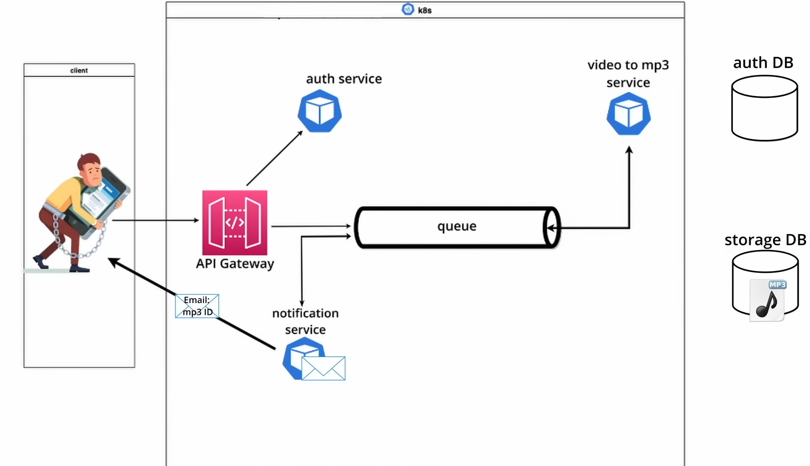

# Video-to-MP3-Conversion-as-a-Service

## Project Description:

**Developed a robust Video-to-MP3 Conversion as a Service application, employing cutting-edge technologies to deliver efficient and scalable multimedia processing.** 

## Key Achievements:

**Microservice Architecture**: Orchestrated a microservice-based architecture, capitalizing on Kubernetes and Docker, to create a flexible and responsive system. This architecture allowed our application to dynamically scale and efficiently manage the processing of over 100 concurrent conversion requests in under a minute.

**Flask Services**: Developed lightweight yet powerful microservices using Flask, enabling seamless handling of video-to-MP3 conversion requests. Flask's simplicity and flexibility made it a valuable choice for building the core functionality.

**Asynchronous Communication**: Implemented asynchronous inter-service communication using RabbitMQ. This approach optimized the overall performance of the system by allowing services to work independently, significantly enhancing responsiveness and resource utilization.

**Data Management**: Employed MongoDB as a data store for efficiently storing input and output files. MongoDB's scalability and document-oriented structure were well-suited for managing multimedia data. Additionally, MySQL was used to maintain user information, ensuring data integrity and robust user management.
